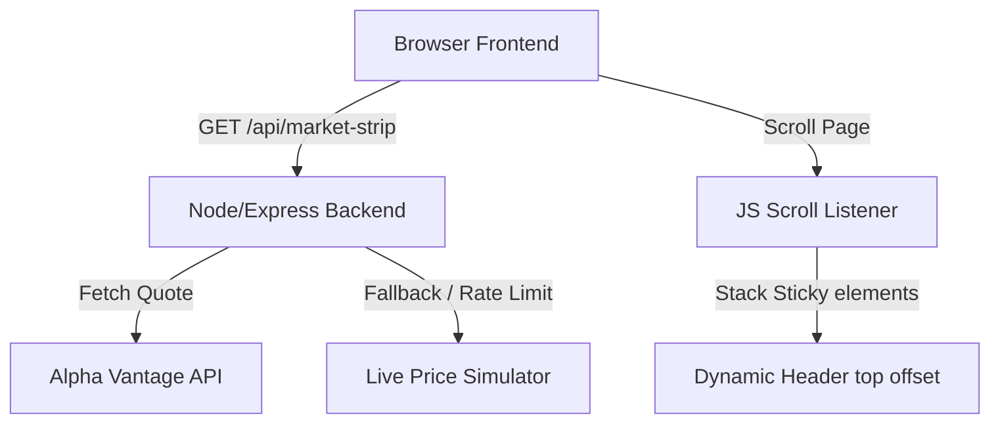

# Specification: Sticky Live Market Stock Data Strip

## Goal
Implement a real-time, sticky market data strip at the top of the homepage displaying stock exchange quotes (NASDAQ/NYSE) using a valid Alpha Vantage API key with backend integration and a robust simulated fallback mechanism.

---

## Architectural Layout



---

## Technical Specifications

### 1. Data Structure (JSON)
The backend endpoint `/api/market-strip` will return a timestamped JSON object with the following schema:

```json
{
  "timestamp": "2026-05-22T15:53:07.000Z",
  "source": "api", 
  "data": {
    "AAPL": {
      "price": 189.84,
      "change": 1.24,
      "changePercent": 0.66
    },
    "MSFT": {
      "price": 421.90,
      "change": -0.85,
      "changePercent": -0.20
    },
    "TSLA": {
      "price": 174.60,
      "change": 2.45,
      "changePercent": 1.42
    },
    "NVDA": {
      "price": 948.79,
      "change": 15.30,
      "changePercent": 1.64
    },
    "AMZN": {
      "price": 181.28,
      "change": -1.12,
      "changePercent": -0.61
    }
  }
}
```

### 2. Backend Integration (`server.js`)
- Expose `/api/market-strip` endpoint.
- Disable all browser caching for this endpoint by setting standard HTTP headers:
  ```javascript
  res.setHeader('Cache-Control', 'no-store, no-cache, must-revalidate, proxy-revalidate');
  res.setHeader('Pragma', 'no-cache');
  res.setHeader('Expires', '0');
  ```
- Store the Alpha Vantage API key in `.env` as `ALPHA_VANTAGE_API_KEY`. No default key is committed to source control for security.
- Implement a sequential query or a cache-bypass system to fetch stock data (symbols: `AAPL`, `MSFT`, `TSLA`, `NVDA`, `AMZN`).
- To handle the Alpha Vantage 5 requests/minute and 25 requests/day free tier limitations:
  - Implement a backend-side cache with a short TTL (e.g. 15 seconds) so that frequent client requests don't hit the API rate limit immediately.
  - Implement a rate-limit detection mechanism. If the Alpha Vantage API returns a rate-limit warning (e.g. `Note: Thank you for using Alpha Vantage!...`), the server will automatically fall back to the live price simulator.
  - The live price simulator will take the last known price values and apply random fluctuations (-0.1% to +0.1%) on every client request, updating the timestamp, and flagging the response source as `"simulated"`.

### 3. Frontend Integration (`public/index.html` & `public/app.js`)
- Move the market data strip to the top of the body, preceding the sticky `<header>`.
- Ticker symbols will be updated to display stock assets (`AAPL`, `MSFT`, `TSLA`, `NVDA`, `AMZN`) instead of crypto/currency assets.
- Fetch data from `/api/market-strip` every 10 seconds.
- Update the pricing elements dynamically. If the backend source is `"simulated"`, display a small indicator or log it in console for developers.

### 4. Sticky Layout CSS/JS Mechanism
- Use CSS to make the market data strip sticky at `top: 0` with a higher `z-index` (e.g., `z-[60]`).
- Use JavaScript to dynamically measure the height of the market data strip and apply that height as the `top` offset of the main `<header>` nav.
- On window resize or content changes, the JavaScript will recalculate this offset.
- Toggle a `.is-scrolled` or `.is-sticky` class on the header when the user scrolls down, allowing custom visual treatments (e.g., shadow adjustment).

### 5. Hero Background Animation (Candlestick Drop)
- Implement a canvas-based dynamic background animation inside the hero section (`#features`).
- Draw falling stock candlesticks with alternating green (primary) and red (error) styling.
- Ensure the animation is smooth, has a subtle background opacity (e.g., 10-25%), and does not block text readability or user interactions (pointer-events-none, low z-index).
- Recalculate dimensions dynamically on window resize events.

### 6. Mobile Layout & Responsive Enhancements
- Navbar: Collapsible navigation panel (`#mobile-menu-panel`) toggled by a hamburger button (`#mobile-menu-btn`) on screen sizes `< 640px` (Tailwind `sm`).
- Leaderboard: Responsive, card-based grid (`#leaderboard-mobile`) on screen sizes `< 768px` (Tailwind `md`).
- Market Heatmap: Bounded square layout (`aspect-ratio: 1/1` and max height `380px`) on mobile viewports.
- Floating Chatbot: Locked max width of `calc(100vw - 32px)` on mobile screens.
- Dashboard Layout: Expose a sticky mobile header bar (`header.flex.md:hidden`) with user metadata and logout shortcuts. Render trader active subscriber lists as a horizontal swipe list rather than a vertical sidebar on screens `< 640px`. Enable modal form scrollbars (`max-h-[90vh] overflow-y-auto`).


---

## Verification Plan

### Automated/Console Verification
- Verify backend endpoint returns valid JSON via local curl:
  `curl http://localhost:3000/api/market-strip`
- Verify that response includes headers preventing cache.
- Inspect console logs for API rate-limiting fallbacks.

### Manual UI Verification
- Scroll down the homepage and verify that the market data strip floats continuously at the very top of the page.
- Verify that the navigation header is stacked directly below the market data strip without gaps or overlaps.
- Resize the browser window to test responsiveness and dynamic height recalculations.
- Check color indicators (green/red) for positive/negative stock price changes.
